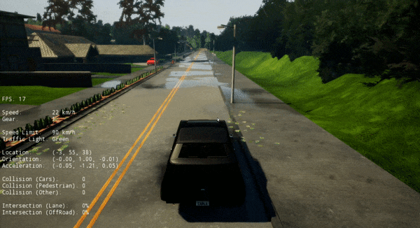
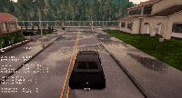
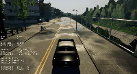
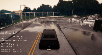
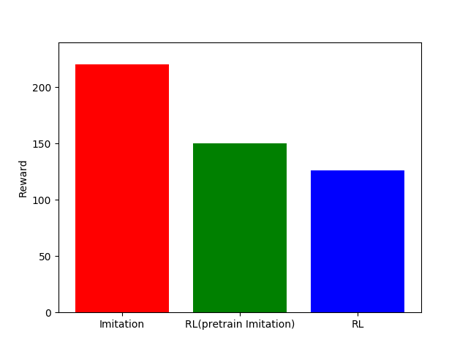
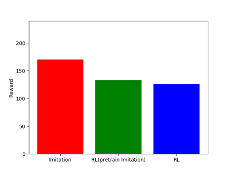
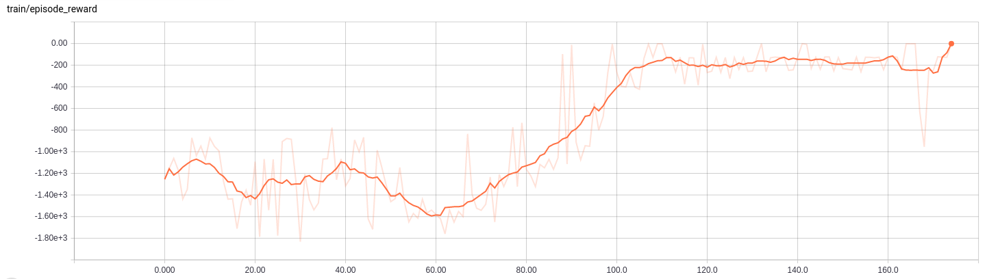
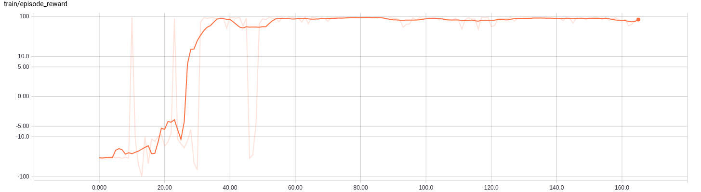
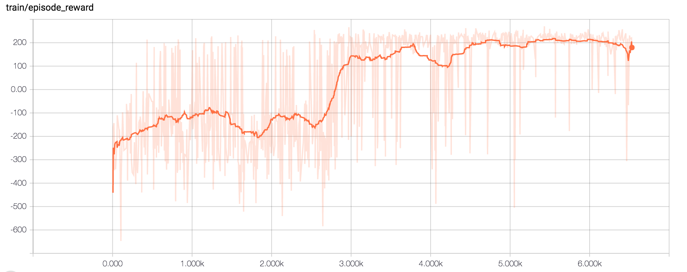

# Self-Driving-Car-CARLA
 Autonomous driving agent in CARLA Simulator trained using reinforcement learning.
 
 # Method to collect data with carla:
 1. Open a terminal in the main installed `carla` package folder. Run the following command to execute package file and start the simulation:
  ``` 
  ./CarlaUE4.sh  
  ``` 
  2. Copy and paste the file `src/utils/datacollector.py`(in this repo) inside your installed carla package at location `PythonAPI/examples` folder.
  3. Open another terminal inside `PythonAPI/example` and run following command to start collecting data:
  ``` 
  python3 datacollector.py --sync -m Town01 -l  
  ```
  4. Optional- Run in parallel in new terminal 
  ```
  python3 generate_traffic.py -n 50 -w 50      # spawn 50 vehicles and pedestrians 
  python3 dynamic_weather.py                   # collect the dataset using varying weather conditions. 
  ```


Add your own models via sources/models.py

# Results

### Imitation
   

### DDPG
     

## Chart
       


&ensp;&ensp;&ensp;&ensp;&ensp;&ensp;&ensp;&ensp;&ensp;&ensp;&ensp;&ensp;&ensp;&ensp;Town1(Train) &ensp;&ensp;&ensp;&ensp;&ensp;&ensp;&ensp;&ensp;&ensp;&ensp;&ensp;&ensp;&ensp;&ensp;&ensp;&ensp;&ensp;&ensp;&ensp;&ensp;&ensp;&ensp;&ensp;&ensp;&ensp;&ensp;&ensp;&ensp;&ensp;Town2(Test)  

## Graphs

              


